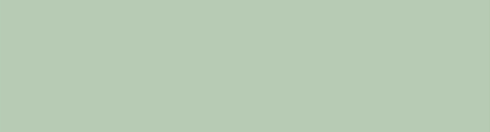

  

 

# kdt255
 

<table>
<tr>
<td align="center" width="250">

**C++**

Modern C++  
Systems & tooling

</td>

<td align="center" width="250">

**IMGUI**

Custom interfaces  
UI architecture

</td>

<td align="center" width="250">

**RE**

Analysis  
Game tooling

</td>
</tr>
</table>

<table>
<tr>
<td align="center">

### Currently

C++ · ImGui · Frameworks

</td>
<td align="center">

### Interests

UI/UX · Reverse Engineering · Game Tools

</td>
</tr>
</table>

### `Keep learning. Keep building. Keep breaking things.`

